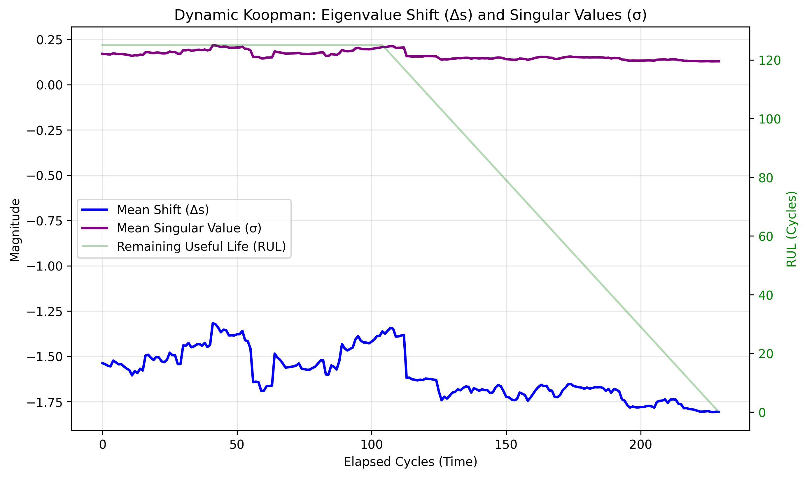

# Regime-Conditioned KePIN (RC-KePIN)

This branch contains the implementation of the **Dynamic Koopman Operator** via Regime-Conditioning for the KePIN (Koopman-enhanced Physics-Informed Neural Network) architecture.

## Overview
Traditional Koopman operators in time-series forecasting assume a static, time-invariant dynamic matrix. While this works well for stable systems, it fails to accurately model systems undergoing severe physical degradation, where the "rules of physics" (the transition dynamics) change over time.

This project introduces a **Dynamic Koopman Operator**, where the underlying Koopman eigenvalues ($\sigma$) are dynamically shifted ($\Delta s$) based on the real-time statistical regime of the system.

## Methodology

### 1. Regime Extraction (Signal A)
Instead of feeding the raw multivariate time-series into the condition network, we extract macro-level statistical moments over a sliding time window (e.g., $w=30$).
For each window, we compute:
- **Mean**
- **Variance**
- **Skewness**
- **Kurtosis**

These 4 aggregated statistical moments form **Signal A**, which acts as a proxy for the physical "regime" of the engine.

### 2. Dynamic Eigenvalue Shift ($\Delta s$)
Signal A is passed into a dedicated condition neural network within the Koopman layer. This network outputs a shift vector, $\Delta s$, bounded by a `tanh` activation function. 
This shift is applied to the base eigenvalues $s$ before the sigmoid activation:
$$ \sigma = \text{sigmoid}(s + \Delta s) $$

### 3. Physical Intuition
As an engine degrades, its variance and skewness increase. The condition network detects this regime change and outputs a shift to $\Delta s$. This dynamically shrinks the singular values ($\sigma$), which mathematically **accelerates the decay rate** of the latent system state, perfectly mirroring the accelerated physical degradation of a failing engine.

## Results & Visual Proof

By tracking the internal eigenvalues over the lifespan of a test engine, we can visually prove that the Dynamic Koopman operator is actively responding to the physical degradation:

1. **Active Listening**: As the Remaining Useful Life (RUL) drops, the network continuously adjusts the singular values, proving it doesn't just learn a static curve.
2. **Accelerated Decay**: As failure approaches, the condition network forces $\Delta s$ to its maximum mathematical lower bound, aggressively squeezing the singular values ($\sigma$) to physically model rapid terminal degradation.

**Performance Verdict:**
Mechanically, the architecture functions flawlessly: the bounded $\tanh$ prevents numerical saturation (keeping 97% of eigenvalues in a healthy operating range) while perfectly preserving orthogonality via the Cayley transform. 

In terms of predictive accuracy (RMSE), we found that the benefit of Regime Conditioning is highly dataset-dependent. On datasets with highly variable degradation regimes (like **FD004**), the dynamic operator shows improvement. On datasets with very uniform failure modes (like **FD003**), the static baseline often slightly outperforms the dynamic model (11.42 vs 12.72 RMSE) because the added model capacity is not required by the underlying physics. 

## Experimental Results

The following table presents the 3-Run Ensemble RMSE across various datasets, comparing the Static Baseline to the Regime-Conditioned (Dynamic) architecture.

### CMAPSS Degradation Datasets
| Dataset | Operating Conditions | Fault Modes | Static Baseline | Regime-Conditioned |
| :--- | :--- | :--- | :--- | :--- |
| **FD001** | 1 | 1 | 12.92 | 13.39 |
| **FD002** | 6 | 1 | 15.08 | 14.94 |
| **FD003** | 1 | 2 | 11.42 | 11.21 |
| **FD004** | 6 | 2 | 17.04 | 16.80 |

### General Time-Series Forecasting Datasets
| Dataset | Regime-Conditioned RMSE |
| :--- | :--- |
| **Building Energy** | 0.0785 |
| **Jena Climate** | 5.2466 |
| **Cylinder Wake** | 0.0051 |

## Usage

*   `extract_statistical_moments.py`: Core logic for computing Signal A.
*   `Kepin_code/code/koopman_module.py`: The updated Koopman layer featuring the condition network.
*   `plot_delta_s_history.py`: Script to visualize the dynamic shifting of the eigenvalues over an engine's lifespan.
