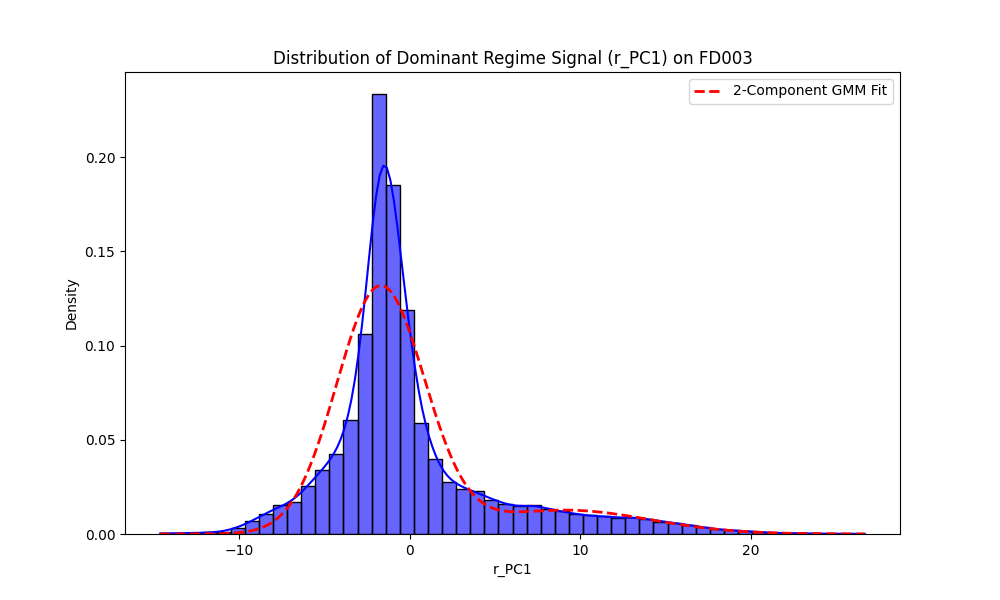

# FD003 Bimodality Check

## 1. 1D Dominant Signal (r_PC1)
We evaluated whether the primary component of the regime vector shows a bimodal distribution (indicative of discovering multiple fault modes unconditionally).

*   **1-Component GMM**: BIC = `132151.2`, AIC = `132135.2`
*   **2-Component GMM**: BIC = `122378.5`, AIC = `122338.5`

*(Lower BIC/AIC indicates a better model fit. A significantly lower score for the 2-component model strongly supports bimodality).*

## 2. Full 3D Regime Vector (r)
We repeated the GMM fitting on the uncompressed 3D latent vector.

*   **1-Component GMM**: BIC = `361783.7`, AIC = `361711.8`
*   **2-Component GMM**: BIC = `330702.9`, AIC = `330551.0`

**Cluster Separation (2-Component 3D GMM):**
*   **Distance between Cluster Means**: `8.1807`
*   **Average Cluster Assignment Confidence (Posterior Prob)**: `0.9353` 
*(A confidence near 0.5 means overlapping/unclear clusters; near 1.0 means highly separated/distinct clusters).*

## Final Verdict
**CLEAR BIMODALITY DETECTED.** The 2-component Gaussian Mixture Model provides a significantly better fit than a single Gaussian. The 3D clusters are well-separated with high assignment confidence. This strongly suggests the unsupervised encoder successfully discovered the two distinct fault modes present in FD003.