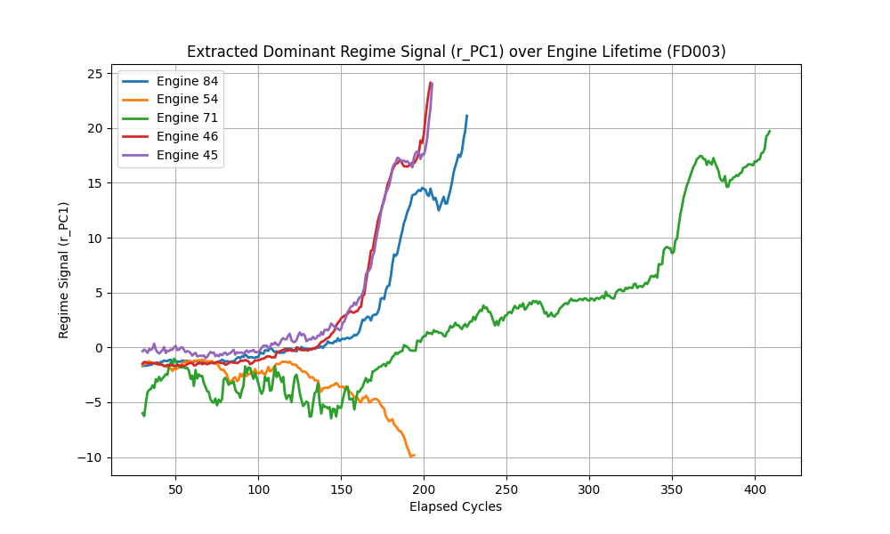

# Phase 2: FD003 Regime Extraction Quality

## 1. Overall Correlation
*   **Pearson with True RUL**: `-0.1868`
*   **Spearman with True RUL**: `0.0869`

## 2. CRITICAL TEST: Within-Bin Correlation (Controlling for Elapsed Time)
To prove the signal captures genuine cross-engine degradation-rate differences and isn't just a trivial elapsed-time proxy, we evaluated correlation within narrow elapsed-cycle bins (width 10 cycles).

*   **Mean Within-Bin Spearman Correlation**: `-0.1678`
*   **Median Within-Bin Spearman Correlation**: `-0.2482`

### Bin Breakdown:
| Elapsed Cycles Bin | Spearman Correlation |
| :--- | :--- |
| [30.0, 40.0) | `0.1749` |
| [40.0, 50.0) | `0.1750` |
| [50.0, 60.0) | `0.2769` |
| [60.0, 70.0) | `0.3574` |
| [70.0, 80.0) | `0.4543` |
| [80.0, 90.0) | `0.4553` |
| [90.0, 100.0) | `0.5072` |
| [100.0, 110.0) | `0.5346` |
| [110.0, 120.0) | `0.5538` |
| [120.0, 130.0) | `0.6079` |
| [130.0, 140.0) | `0.6073` |
| [140.0, 150.0) | `0.6077` |
| [150.0, 160.0) | `0.5827` |
| [160.0, 170.0) | `0.5635` |
| [170.0, 180.0) | `0.4379` |
| [180.0, 190.0) | `0.2987` |
| [190.0, 200.0) | `0.1381` |
| [200.0, 210.0) | `-0.0330` |
| [210.0, 220.0) | `0.0103` |
| [220.0, 230.0) | `-0.1011` |
| [230.0, 240.0) | `-0.1624` |
| [240.0, 250.0) | `-0.2815` |
| [250.0, 260.0) | `-0.2148` |
| [260.0, 270.0) | `-0.1850` |
| [270.0, 280.0) | `-0.5292` |
| [280.0, 290.0) | `-0.7328` |
| [290.0, 300.0) | `-0.7163` |
| [300.0, 310.0) | `-0.6487` |
| [310.0, 320.0) | `-0.5643` |
| [320.0, 330.0) | `-0.4307` |
| [330.0, 340.0) | `-0.4671` |
| [340.0, 350.0) | `-0.5585` |
| [350.0, 360.0) | `-0.6046` |
| [360.0, 370.0) | `-0.6825` |
| [370.0, 380.0) | `-0.7378` |
| [380.0, 390.0) | `-0.8445` |
| [390.0, 400.0) | `-0.9074` |
| [400.0, 410.0) | `-0.9163` |
| [410.0, 420.0) | `-0.8274` |
| [420.0, 430.0) | `-0.5813` |
| [430.0, 440.0) | `-0.3904` |
| [440.0, 450.0) | `-0.5174` |
| [450.0, 460.0) | `-0.6287` |
| [460.0, 470.0) | `-0.4048` |
| [470.0, 480.0) | `-0.6296` |
| [480.0, 490.0) | `-0.7650` |

## 3. Smoothness
*   **Step-to-step variance**: `0.0905`
*   **Overall variance**: `34.1142`
*   **Ratio (Step Var / Overall Var)**: `0.0027` (lower is smoother)

## Final Verdict
**NOT MEANINGFUL.** The within-bin correlation collapsed to near zero, indicating that the signal is mostly a redundant proxy for elapsed time and fails to capture genuine cross-engine degradation differences.