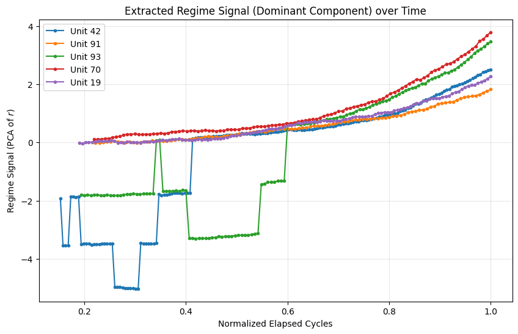

# Phase 2: Regime Extraction Quality

## Evaluation Metrics

### Correlation Analysis
*   **Correlation with True RUL**: 
    *   Pearson: `-0.6645`
    *   Spearman: `-0.7994`
*   **Correlation with Normalized Elapsed Cycles**:
    *   Pearson: `0.6745`
    *   Spearman: `0.8259`

*(Note: High correlation with elapsed cycles suggests the regime vector is strongly acting as a time-index proxy, which provides a meaningful monotonic trend but may not capture complex failure modes beyond "how far into the run we are".)*

### Smoothness
*   **Step-to-step variance (mean per unit)**: `0.080372`
*(Lower is smoother. Erratic jumps would result in a high variance.)*

## Trajectory Visualization
The plot below shows the dominant component of the extracted 3D regime vector $r$ for a random sample of 5 engines over their lifetime.

## Verdict
**MEANINGFUL**. The extracted signal shows a strong correlation with degradation and elapsed time, indicating a plausible monotonic trend from healthy to near-failure.
